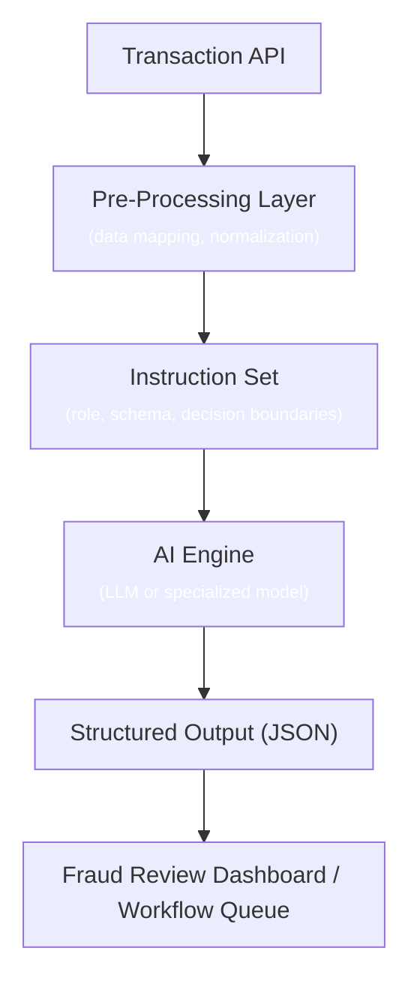

# Constructing System Instructions for AI-Driven API & Transaction Analysis

## Intro

This article explores how structured system instructions and schema enforcement can help AI systems deliver consistent, explainable decisions in payments and fraud detection. It covers prompt engineering, decision boundaries, and explainability hooks to ensure predictable AI outputs in regulated, high-stakes environments.

In payments and fraud detection, *speed* is essential — but *accuracy* is non-negotiable. The space between raw transaction data and a confident “Approve” or “Decline” decision is where operational risk lies. False declines can create unnecessary revenue loss and strain customer trust, while missed fraud can lead to chargebacks, penalties, and reputational harm.

## Why System Instructions Matter

AI is not a magic box — it is fundamentally a **pattern recognizer**.

Without precise guidance:
- Identical transactions may yield inconsistent AI decisions.
- Explainability gaps can arise under regulatory review.
- Downstream systems may receive outputs in unusable formats.

The goal is to ensure:
- **Consistency**: Similar inputs should lead to similar outputs.
- **Traceability**: Every decision has a documented rationale.
- **Compliance alignment**: Rules are enforced in a repeatable way.

Think of AI as a **junior fraud analyst**. It requires structured policies, clear workflows, and guardrails to operate effectively.

## Core Instruction Patterns

### 1. Role Definition

```text
You are a fraud detection analyst evaluating API transaction responses for risk signals based on:
  - MCC codes
  - AVS/CVV results
  - Geolocation
  - Transaction velocity

Your goal is to recommend one of the following actions:
  - "Approve"
  - "Decline"
  - "Escalate"

Provide a short explanation for your decision.
```

### 2. Data Framing

```json
{
  "transaction_id": "T12345",
  "mcc_code": "5999",
  "avs_result": "N",
  "cvv_result": "M",
  "ip_country": "CN",
  "billing_country": "US",
  "amount": 250.00
}
```

### 3. Decision Boundaries

```text
If required fields are missing,
the data is inconclusive,
or key checks cannot be verified,
return the action "Escalate".
```

### 4. Explainability Hooks

```json
{
  "action": "Decline",
  "explanation": "AVS mismatch and IP country mismatch."
}
```

## Example Transaction Review Workflow



## Sample AI Instruction Template

```text
You are a fraud detection analyst.
Evaluate the transaction data and decide whether to "Approve", "Decline", or "Escalate" based on:
  - MCC risk profiles
  - AVS/CVV results
  - IP and billing country match
  - Amount thresholds

Rules:
  1. If key data is missing, return "Escalate".
  2. Provide a one-sentence explanation citing data points.
  3. Output must match JSON schema.
```

## Potential Benefits (To Be Tested)

Structured AI instruction sets may help teams:

- Produce more predictable results across transaction types.
- Reduce unnecessary escalations through “no guess” rules.
- Increase analyst trust by providing consistent explanations.

Outcomes must always be validated, monitored, and adjusted over time.

## Implementation Checklist

- Define the AI role clearly.
- Map decision logic in advance.
- Enforce schemas — avoid freeform outputs.
- Test against real & synthetic cases.
- Version and monitor instructions continuously.

## Common Pitfalls

- Freeform prompts with no schema enforcement.
- No escalation path for incomplete data.
- Instruction changes without documentation.
- Untested modifications deployed directly.

## Closing

AI in payments is about scaling human judgment safely.

By defining roles, enforcing structured inputs/outputs, and monitoring performance, teams can explore AI’s potential in transaction review.

Baseline performance must always be tracked, outputs validated, and adjustments made as fraud patterns and regulations evolve. What works today may require recalibration tomorrow — adaptability is key to long-term success.
