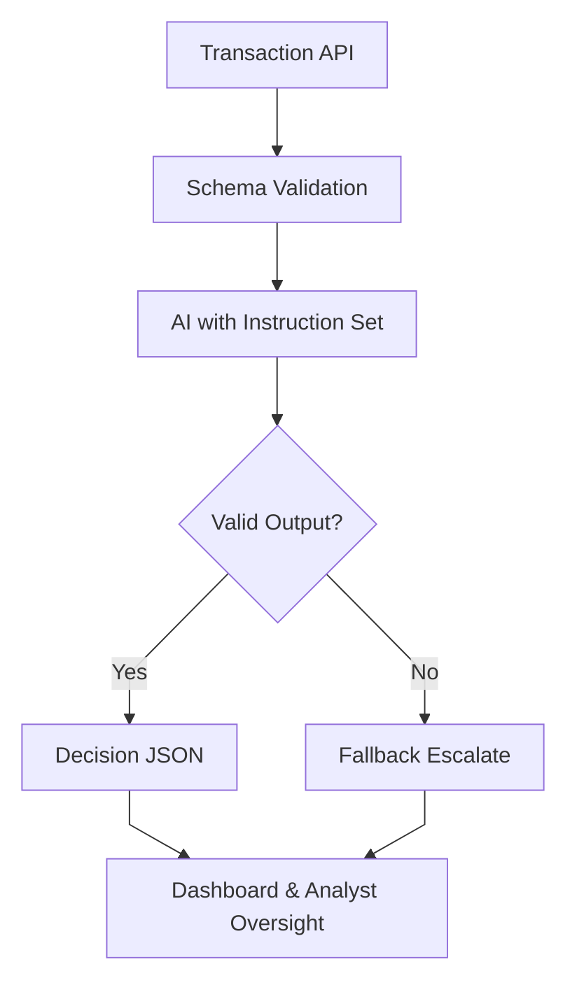

# Constructing System Instructions

## Intro

This guide outlines how to implement structured system instructions in payment environments. The goal is to ensure AI delivers predictable, explainable results in fraud detection and transaction analysis while remaining flexible for iteration.

---

## 1. Define the Role & Boundaries

```json
{
  "role": "Fraud Analyst",
  "objective": "Classify transactions as APPROVE, DECLINE, or ESCALATE with explanation.",
  "constraints": [
    "Never guess if data is missing",
    "If unclear, always return ESCALATE"
  ]
}
```
Treat this as a contract — not prose.

## 2. Input Schema

```json
{
  "transaction_id": "string",
  "amount": "number",
  "currency": "string",
  "avs_result": "string",
  "cvv_result": "string",
  "merchant_category_code": "string",
  "ip_country": "string"
}
```
Reject or sanitize inputs that don’t conform.

## 3. Output Schema

```json
{
  "decision": "APPROVE | DECLINE | ESCALATE",
  "reasoning": "string",
  "risk_flags": ["AVS_MISMATCH", "HIGH_VALUE", "IP_GEO_MISMATCH"]
}
```
Predefine allowed values.

## 4. Test with Known Cases

✅ Approved: AVS + CVV match, low risk.

❌ Declined: AVS mismatch, high-risk location.

⚠️ Escalated: Missing CVV data.

Log mismatches for tuning.

## 5. Error Handling

```python
response = call_ai(transaction)
if not validate_schema(response):
  return {"decision": "ESCALATE", "reasoning": "Invalid AI output"}
```

## 6. Monitor & Iterate

Compare AI vs. human reviewer outcomes.

Analyze failure patterns.

Update instruction boundaries.

Re-test continuously.

## 7. Compliance & Explainability

Every output should include:

- Decision (approve/decline/escalate)
- Reasoning (human-readable)
- Audit Trail (timestamp, inputs, outputs, instruction version)

## Example Flow



## Closing

System instructions are the backbone of reliable AI in payments. With schemas, clear boundaries, and continuous monitoring, teams can move from unpredictable “black box” answers to auditable and trusted outputs.
