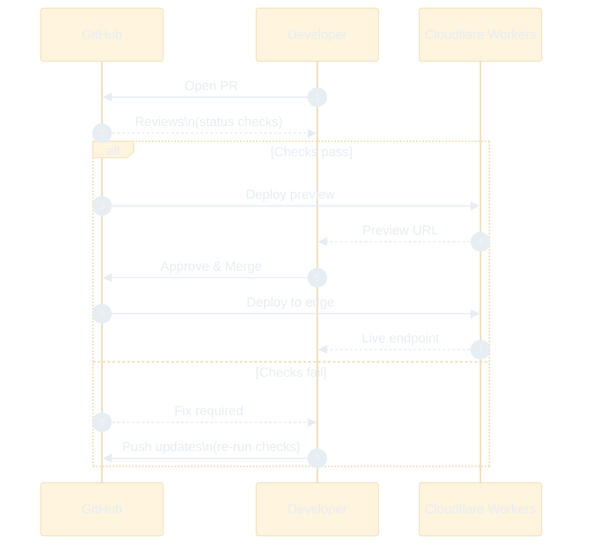

# Guide: AI-Powered Cloud Development with React, Hono, and Cloudflare

## Overview
This guide walks through creating a modern cloud-native app using:

- **React** → UI layer  
- **Hono** → lightweight backend framework  
- **Cloudflare Workers** → deploy globally at the edge  
- **pnpm** → modern package manager  
- **GitHub** → version control & branching  
- **AI Assistants** → scaffolding code, generating tests, optimizing workflow  

⚠️ *Note: AI-generated code must be reviewed before production use. Treat AI as an accelerator, not a replacement for engineering oversight.*

---

## 1. Prerequisites
- Node.js (LTS recommended)  
- pnpm installed globally:  
  ```bash
  npm install -g pnpm
  ```
- GitHub account + Git configured  
- Cloudflare account with [Wrangler CLI](https://developers.cloudflare.com/workers/wrangler/install-and-update/) installed  

---

## 2. Scaffold the Frontend
Use Vite + React with **pnpm**:

```bash
# Create new React project
pnpm create vite my-app

# Enter project directory
cd my-app

# Install dependencies
pnpm install
```

---

## 3. Add Hono Backend
Install and set up a simple Hono route:

```bash
pnpm add hono
```

Create **src/api/index.ts**:

```ts
import { Hono } from 'hono'

const app = new Hono()

app.get('/api/hello', (c) => c.json({ message: 'Hello World from Hono!' }))

export default app
```

---

## 4. Initialize Git & Push to GitHub
```bash
# Initialize Git
git init
git add .
git commit -m "Initial commit - React + Hono scaffold"

# Add GitHub remote (replace with your repo)
git remote add origin https://github.com/your-username/my-app.git
git push -u origin main
```

---

## 5. Use Git Branches for AI-Assisted Code
Whenever testing AI-generated code, branch off:

```bash
git checkout -b feature/ai-dashboard
```

Commit AI outputs safely:

```bash
git add src/components/Dashboard.tsx
git commit -m "AI-generated dashboard"
```

---

## 6. AI-Assisted UI Example
Prompt an AI assistant with:

```
Generate a dark-themed dashboard in React + Tailwind CSS.  
Include three metric cards: Transactions, Subscriptions, Errors.  
```

Commit results to your feature branch.  

---

## 7. AI-Assisted Testing
Prompt AI to create a Playwright test:

```
Write a Playwright test that verifies `/api/hello`  
returns a 200 and { "message": "Hello World from Hono!" }
```

Save as **tests/api.test.ts**:

```ts
import { test, expect } from '@playwright/test'

test('GET /api/hello', async ({ request }) => {
  const res = await request.get('/api/hello')
  expect(res.status()).toBe(200)
  const body = await res.json()
  expect(body.message).toBe('Hello World from Hono!')
})
```

Commit the test:

```bash
git add tests/api.test.ts
git commit -m "Add AI-generated Playwright test"
```

---

## 8. Deploy to Cloudflare Workers
Deploy with **pnpm**:

```bash
pnpm dlx wrangler deploy
```

Your endpoint will be live globally:  
```
https://my-app.username.workers.dev/api/hello
```

---

## 9. GitHub Pull Request Workflow
Push feature branch:

```bash
git push origin feature/ai-dashboard
```

Open a Pull Request on GitHub:  
- Run tests in CI/CD pipeline  
- Review AI-generated code  
- Merge into **main** when stable  

---

## Sequence Diagram of Workflow



---

## 10. Next Steps
- Add authentication & role-based access  
- Integrate payments or external APIs  
- Layer in AI-driven analytics  
- Automate observability & monitoring  

---

## Key Takeaways
- **pnpm** streamlines setup and dependency management  
- **Hono** + **Cloudflare Workers** = scalable edge-first architecture  
- **GitHub branches** keep AI-assisted code reviewable and safe  
- **AI** accelerates scaffolding, testing, and deployment — but requires human oversight  
